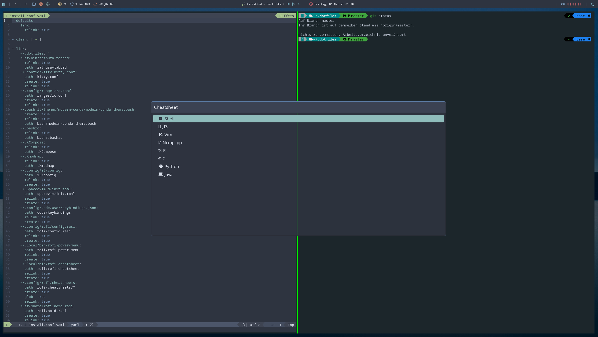

# Dotfiles


### Install
Using git with ssh:

```
git clone git@github.com:Data-Hero/dotfiles.git .dotfiles && cd .dotfiles && git submodule init && ./install
```

### Window Manager
For the X Window System i am currently using [i3-gaps](https://github.com/Airblader/i3) with [Plasma integrations](https://github.com/heckelson/i3-and-kde-plasma) on top of KDE Plasma.

### Polybar
The polybar config is a forest theme from adi1090x's [collection](https://github.com/adi1090x/polybar-themes) using a nord colorscheme.

### Rofi
[Nord](https://github.com/undiabler/nord-rofi-theme/blob/master/nord.rasi) themed rofi with a [power menu](https://github.com/jluttine/rofi-power-menu) 
including a configurable cheatsheet:

### Terminal Emulator
My solution is the gpu driven [kitty](https://github.com/kovidgoyal/kitty) with [konsole](https://github.com/KDE/konsole) as a backup in case my gpu is busy.

### Additional Tools
- [feh](https://github.com/derf/feh): Sets wallpapers
- [ranger](https://github.com/ranger/ranger): Dolphin alternative for the terminal
